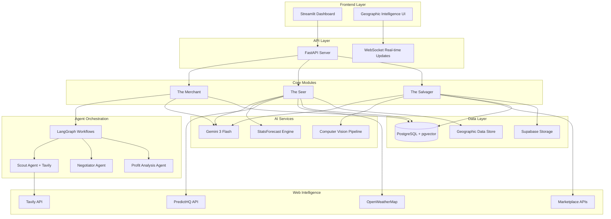
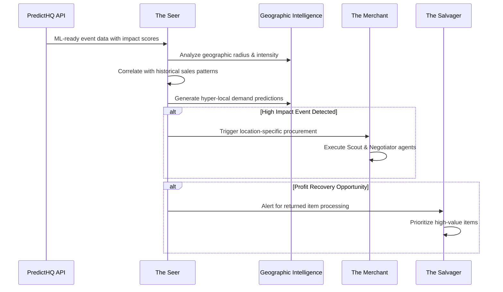

# Design Document

## Overview

Ronin Supply is implemented as a modular monolith architecture with three specialized AI-powered modules that leverage cutting-edge web intelligence and hyper-local forecasting. The system uses Gemini 3 Flash for enhanced AI reasoning, Tavily API for real-time web intelligence, and PredictHQ for ML-ready event data with impact scoring. Each module operates autonomously while communicating through an event-driven architecture optimized for profit recovery and micro-event forecasting.

The three core modules are:
- **The Merchant**: Autonomous supply chain negotiation using Scout and Negotiator agents with web intelligence
- **The Seer**: Hyper-local micro-event forecasting with geographic precision and real-time web data  
- **The Salvager**: Advanced computer vision grading with profit recovery optimization and marketplace automation

## Architecture

### Enhanced System Architecture



### Hyper-Local Event Processing Flow



## Components and Interfaces

### The Merchant Module (Enhanced)

**Scout Agent with Web Intelligence**:
- **Purpose**: Discovers supplier contacts using advanced web intelligence
- **Input**: Product specifications, supplier names, geographic constraints
- **Output**: Comprehensive supplier profiles with contact data, pricing history, and reliability scores
- **Technology**: Tavily API for structured web extraction, Gemini 3 Flash for analysis
- **Enhancement**: Real-time market intelligence and competitive analysis

**Negotiator Agent with Auto-Personality**:
- **Purpose**: Conducts sophisticated email negotiations with adaptive communication
- **Input**: Supplier profiles, market conditions, urgency levels, cultural context
- **Output**: Optimized pricing agreements with delivery terms
- **Technology**: Gemini 3 Flash for advanced reasoning, smtplib for secure communication
- **Enhancement**: Cultural adaptation and urgency-based negotiation strategies

### The Seer Module (Hyper-Local Intelligence)

**Micro-Event Intelligence Engine**:
- **PredictHQ Integration**: ML-ready event data with impact scoring and geographic precision
- **Tavily Web Intelligence**: Real-time web scraping for local events, news, and trends
- **Weather Correlation**: Hyper-local weather patterns affecting micro-regional demand
- **Geographic Processing**: Zip code level analysis with radius-based impact modeling

**Advanced Forecasting Engine**:
- **Technology**: Nixtla StatsForecast with geographic segmentation
- **Models**: Location-aware AutoARIMA, Geographic ETS, Event-driven Prophet
- **Input**: Historical sales, event impact scores, weather patterns, local trends
- **Output**: 48-hour precision forecasts with confidence intervals and geographic boundaries
- **Enhancement**: Micro-event correlation with demand multiplier calculations

**Geographic Intelligence System**:
- **Purpose**: Provides hyper-local market intelligence and inventory optimization
- **Capabilities**: Zip code granularity, transportation cost modeling, local regulation compliance
- **Integration**: Real-time event monitoring with automated alert systems
- **Output**: Location-specific inventory recommendations with profit optimization

### The Salvager Module (Profit Recovery Engine)

**Advanced Visual Grading Pipeline**:
- **Input**: Multi-angle photos, product specifications, market data
- **Processing**: Gemini 3 Flash Vision for defect detection, authenticity verification, completeness assessment
- **Analysis**: Profit recovery potential calculation, market value estimation
- **Output**: Profit-optimized grading with resale channel recommendations
- **Enhancement**: Fraud detection and authenticity verification

**Marketplace Automation System**:
- **Channels**: eBay, Poshmark, Amazon Renewed, Facebook Marketplace, Parts channels
- **Capabilities**: Automated listing creation, dynamic pricing, performance tracking
- **Optimization**: Channel-specific description generation, competitive pricing analysis
- **Integration**: Real-time market monitoring with price adjustment algorithms

**Profit Recovery Optimization**:
- **Analysis**: Expected profit margins, time-to-sale predictions, channel fees
- **Strategy**: Dynamic routing based on market conditions and item characteristics
- **Learning**: Continuous improvement through sales performance tracking
- **Reporting**: Profit recovery analytics with ROI optimization recommendations

## Data Models

### Enhanced Core Entities

```python
# Geographic Event Model
class GeographicEvent:
    id: UUID
    event_id: str  # PredictHQ event ID
    title: str
    category: str  # concerts, sports, weather, political
    start_date: datetime
    end_date: datetime
    impact_score: float  # PredictHQ ML impact score
    geographic_center: Point  # PostGIS point
    impact_radius_km: float
    predicted_attendance: int
    demand_multiplier: Dict[str, float]  # product_category -> multiplier
    created_at: datetime

# Hyper-Local Forecast Model
class HyperLocalForecast:
    id: UUID
    product_id: UUID
    zip_code: str
    forecast_date: date
    predicted_demand: int
    confidence_interval_lower: int
    confidence_interval_upper: int
    triggering_events: List[UUID]  # GeographicEvent IDs
    geographic_factors: Dict[str, Any]
    demand_multiplier: float
    model_used: str
    created_at: datetime

# Profit Recovery Item Model
class ProfitRecoveryItem:
    id: UUID
    original_order_id: UUID
    product_id: UUID
    return_reason: str
    photos: List[str]  # Supabase storage URLs
    
    # Enhanced grading
    condition_grade: str  # Mint, Good, Parts, Recycle
    authenticity_score: float
    completeness_score: float
    defects_detected: List[Dict[str, Any]]
    
    # Profit optimization
    estimated_market_value: Decimal
    profit_recovery_channels: List[Dict[str, Any]]
    selected_channel: str
    expected_profit_margin: float
    time_to_sale_estimate: int  # days
    
    # Marketplace integration
    listing_id: Optional[str]
    listing_url: Optional[str]
    current_price: Optional[Decimal]
    listing_status: str  # draft, active, sold, expired
    
    processed_at: datetime
    sold_at: Optional[datetime]
    actual_sale_price: Optional[Decimal]

# Web Intelligence Cache Model
class WebIntelligenceCache:
    id: UUID
    query_type: str  # supplier_research, market_analysis, event_data
    query_parameters: Dict[str, Any]
    source: str  # tavily, predicthq, openweather
    raw_data: Dict[str, Any]
    processed_data: Dict[str, Any]
    confidence_score: float
    expires_at: datetime
    created_at: datetime

# Enhanced Supplier Model
class EnhancedSupplier:
    id: UUID
    name: str
    contact_email: str
    contact_phone: str
    website: str
    
    # Web intelligence data
    company_size: Optional[str]
    industry_category: str
    geographic_regions: List[str]
    reliability_score: float
    market_reputation: Dict[str, Any]
    
    # Communication optimization
    preferred_communication_style: str
    cultural_context: Dict[str, Any]
    response_patterns: Dict[str, Any]
    
    # Performance tracking
    average_response_time: int  # hours
    negotiation_success_rate: float
    price_flexibility: float
    
    created_at: datetime
    last_contact: datetime
    last_intelligence_update: datetime
```

### Geographic Intelligence Schema

```sql
-- Enable PostGIS for geographic data
CREATE EXTENSION IF NOT EXISTS postgis;

-- Geographic events with spatial indexing
CREATE TABLE geographic_events (
    id UUID PRIMARY KEY,
    event_id VARCHAR UNIQUE,
    title VARCHAR NOT NULL,
    category VARCHAR NOT NULL,
    start_date TIMESTAMP NOT NULL,
    end_date TIMESTAMP NOT NULL,
    impact_score FLOAT NOT NULL,
    geographic_center GEOMETRY(POINT, 4326),
    impact_radius_km FLOAT NOT NULL,
    predicted_attendance INTEGER,
    demand_multiplier JSONB,
    created_at TIMESTAMP DEFAULT NOW()
);

-- Spatial index for geographic queries
CREATE INDEX idx_geographic_events_location 
ON geographic_events USING GIST (geographic_center);

-- Hyper-local forecasts with zip code indexing
CREATE TABLE hyperlocal_forecasts (
    id UUID PRIMARY KEY,
    product_id UUID REFERENCES products(id),
    zip_code VARCHAR(10) NOT NULL,
    forecast_date DATE NOT NULL,
    predicted_demand INTEGER NOT NULL,
    confidence_interval_lower INTEGER NOT NULL,
    confidence_interval_upper INTEGER NOT NULL,
    triggering_events UUID[],
    geographic_factors JSONB,
    demand_multiplier FLOAT NOT NULL,
    model_used VARCHAR NOT NULL,
    created_at TIMESTAMP DEFAULT NOW()
);

-- Composite index for efficient querying
CREATE INDEX idx_hyperlocal_forecasts_location_date 
ON hyperlocal_forecasts (zip_code, forecast_date);
```

## Correctness Properties

*A property is a characteristic or behavior that should hold true across all valid executions of a system—essentially, a formal statement about what the system should do. Properties serve as the bridge between human-readable specifications and machine-verifiable correctness guarantees.*

### Property 1: Micro-Event Impact Analysis
*For any* detected micro-event, the system should analyze impact scoring and geographic radius to determine demand correlation patterns
**Validates: Requirements 2.2**

### Property 2: Hyper-Local Pattern Identification
*For any* event-sales correlation analysis, the system should identify patterns at zip code granularity with temporal precision
**Validates: Requirements 2.3**

### Property 3: Demand Spike Temporal Precision
*For any* predicted demand spike, the system should specify exact 48-hour timeframes and confidence levels
**Validates: Requirements 2.4**

### Property 4: Location-Specific Workflow Triggering
*For any* high-impact event identification, the system should trigger location-specific automatic ordering workflows
**Validates: Requirements 2.5**

### Property 5: Geographic Prediction Completeness
*For any* generated prediction, the system should include geographic boundaries and expected demand multipliers
**Validates: Requirements 2.6**

### Property 6: Enhanced Visual Analysis Completeness
*For any* uploaded item photo, the Salvager analysis should detect defects, authenticity markers, completeness, and market condition using Gemini 3 Flash Vision
**Validates: Requirements 3.1, 3.2**

### Property 7: Profit Recovery Grade Assignment
*For any* completed grading analysis, the system should assign profit recovery grades from the defined set (Mint/Resell Full Price, Good/Discount, Parts/Refurb, Recycle)
**Validates: Requirements 3.3**

### Property 8: Optimal Resale Channel Routing
*For any* graded item, the system should automatically route to optimal resale channels (eBay, Poshmark, Amazon Renewed, Parts) based on profit optimization
**Validates: Requirements 3.4**

### Property 9: Profit Recovery Calculation Completeness
*For any* routing decision, the system should calculate expected profit recovery percentages and timeframes for optimal channel selection
**Validates: Requirements 3.5**

### Property 10: Channel-Optimized Listing Generation
*For any* resale item, the system should generate optimized descriptions and competitive pricing specific to each marketplace channel
**Validates: Requirements 3.6**

### Property 11: Fraud Detection and Flagging
*For any* item analysis where fraud is suspected, the system should flag items for manual review with detailed authenticity analysis
**Validates: Requirements 3.7**

### Property 12: Tavily Web Intelligence Integration
*For any* web intelligence requirement, the system should use Tavily API for real-time, structured web data extraction optimized for AI processing
**Validates: Requirements 7.3**

### Property 13: Consistent Prompt Engineering
*For any* natural language processing operation, the system should maintain consistent prompt engineering patterns across all AI interactions
**Validates: Requirements 7.4**

### Property 14: AI Error Handling and Fallbacks
*For any* AI response generation, the system should implement proper error handling and fallback mechanisms for service failures
**Validates: Requirements 7.5**

### Property 15: Intelligent Rate Limiting and Priority Queuing
*For any* API limit approach, the system should implement intelligent rate limiting with priority-based queuing for critical operations
**Validates: Requirements 7.6**

### Property 16: PredictHQ ML-Ready Data Retrieval
*For any* PredictHQ API connection, the system should retrieve ML-ready event data with impact scoring for accurate demand correlation
**Validates: Requirements 8.1**

### Property 17: Structured Web Data Extraction
*For any* Tavily API usage, the system should extract structured, AI-optimized web data for supplier research and market intelligence
**Validates: Requirements 8.2**

### Property 18: Hyper-Local Weather Data Integration
*For any* OpenWeatherMap access, the system should fetch hyper-local weather data that impacts micro-regional demand patterns
**Validates: Requirements 8.3**

### Property 19: Optimized Web Scraping with Rate Limiting
*For any* web scraping need, the system should use Tavily's optimized extraction capabilities with proper rate limiting
**Validates: Requirements 8.4**

### Property 20: Intelligent API Retry Mechanisms
*For any* API failure, the system should implement intelligent retry mechanisms with exponential backoff based on failure type
**Validates: Requirements 8.5**

### Property 21: Event-Urgency Based Data Refresh
*For any* critical data freshness requirement, the system should refresh web intelligence sources according to event urgency levels
**Validates: Requirements 8.6**

### Property 22: Multi-Channel Profit Recovery Calculation
*For any* graded item, the system should calculate expected profit recovery percentages for each available resale channel
**Validates: Requirements 11.1**

### Property 23: Dynamic Pricing Strategy Adjustment
*For any* market condition change, the system should dynamically adjust pricing strategies for optimal profit recovery
**Validates: Requirements 11.2**

### Property 24: Comprehensive Channel Selection Criteria
*For any* resale channel selection, the system should consider fees, target audience, and time-to-sale factors in the decision
**Validates: Requirements 11.3**

### Property 25: Channel-Optimized Listing Creation
*For any* marketplace listing creation, the system should generate channel-optimized descriptions and competitive pricing
**Validates: Requirements 11.4**

### Property 26: Performance-Based Learning and Improvement
*For any* sales performance tracking, the system should learn from results and improve routing decisions over time
**Validates: Requirements 11.5**

### Property 27: Alternative Recovery Strategy Recommendations
*For any* item not meeting profit thresholds, the system should recommend alternative recovery strategies
**Validates: Requirements 11.6**

### Property 28: Precise Geographic Impact Analysis
*For any* event analysis, the system should determine precise geographic impact radius and intensity for demand forecasting
**Validates: Requirements 12.1**

### Property 29: Exact Geographic Demand Specification
*For any* demand prediction, the system should specify exact zip codes and neighborhoods affected by the forecasted changes
**Validates: Requirements 12.2**

### Property 30: Location-Specific Inventory Allocation
*For any* inventory allocation decision, the system should consider location-specific factors and operational constraints
**Validates: Requirements 12.3**

### Property 31: Cumulative Geographic Impact Calculation
*For any* geographically overlapping events, the system should calculate cumulative demand impact across all affected areas
**Validates: Requirements 12.4**

### Property 32: Transportation-Optimized Distribution
*For any* inventory distribution decision, the system should optimize allocation across locations considering transportation costs
**Validates: Requirements 12.5**

### Property 33: Regulatory Compliance Integration
*For any* decision where local regulations apply, the system should incorporate compliance requirements into the decision logic
**Validates: Requirements 12.6**

## Error Handling

### Enhanced AI Service Failures
- **Gemini 3 Flash Failures**: Circuit breaker pattern with intelligent fallback to cached responses
- **Rate Limiting**: Priority-based queuing (urgent forecasting > negotiation > grading)
- **Model Degradation**: Automatic fallback to Gemini 2.5 Flash when 3 Flash is unavailable
- **Context Window Management**: Intelligent prompt truncation for large context scenarios

### Web Intelligence Failures
- **Tavily API Failures**: Exponential backoff with fallback to cached web intelligence data
- **PredictHQ Failures**: Graceful degradation to weather-only forecasting
- **Data Staleness**: Automatic refresh triggers based on data criticality and age
- **Geographic Service Failures**: Fallback to broader geographic regions when precise data unavailable

### Marketplace Integration Failures
- **Listing Failures**: Retry with alternative channels and manual review queue
- **Pricing API Failures**: Fallback to historical pricing data with confidence adjustments
- **Authentication Issues**: Multi-channel authentication with automatic token refresh
- **Channel-Specific Errors**: Intelligent routing to alternative channels based on error type

### Geographic Intelligence Failures
- **PostGIS Failures**: Fallback to simplified distance calculations
- **Coordinate Validation**: Automatic correction for invalid geographic coordinates
- **Spatial Query Optimization**: Query simplification for performance under load
- **Data Consistency**: Cross-validation between geographic data sources

## Testing Strategy

### Enhanced Dual Testing Approach

**Unit Tests with Geographic Data**:
- Location-specific test cases with real zip codes and coordinates
- Marketplace integration testing with sandbox APIs
- Web intelligence mocking with realistic response patterns
- Cultural adaptation testing with diverse supplier profiles

**Property-Based Tests with Advanced Generators**:
- Geographic coordinate generation within valid ranges
- Event data generation with realistic impact scores and timing
- Profit margin calculation testing across all resale channels
- Multi-language communication testing for cultural adaptation

### Advanced Property-Based Testing Configuration

**Framework**: Hypothesis with custom geographic and marketplace strategies
**Test Configuration**: Minimum 100 iterations with geographic boundary testing
**Performance Testing**: Load testing for real-time web intelligence queries
**Integration Testing**: End-to-end testing with external API sandboxes

**Enhanced Property Test Structure**:
```python
from hypothesis import given, strategies as st
from hypothesis.extra.numpy import arrays
import pytest

@given(
    st.floats(min_value=-90, max_value=90),  # latitude
    st.floats(min_value=-180, max_value=180),  # longitude
    st.floats(min_value=0.1, max_value=100)  # radius_km
)
def test_geographic_event_impact_calculation(lat, lon, radius):
    """
    Feature: ronin-supply, Property 1: Hyper-Local Event Impact Calculation
    For any geographic event, system should calculate demand multipliers for affected zip codes
    """
    # Test implementation with PostGIS queries
    pass

@given(st.text(min_size=1, max_size=100))
def test_web_intelligence_data_freshness(query):
    """
    Feature: ronin-supply, Property 2: Web Intelligence Data Freshness
    For any web intelligence query, system should use Tavily API with proper caching
    """
    # Test implementation with Tavily API mocking
    pass
```

### Testing Coverage Requirements

**The Merchant Module (Enhanced)**:
- Unit tests: Tavily integration, cultural adaptation, negotiation optimization
- Property tests: Web intelligence consistency, communication adaptation, pricing optimization

**The Seer Module (Hyper-Local)**:
- Unit tests: PredictHQ integration, geographic calculations, micro-event processing
- Property tests: Geographic precision, temporal accuracy, demand correlation

**The Salvager Module (Profit Recovery)**:
- Unit tests: Marketplace APIs, profit calculations, fraud detection
- Property tests: Grading consistency, profit optimization, channel selection

**Geographic Intelligence**:
- Unit tests: PostGIS queries, coordinate validation, spatial calculations
- Property tests: Geographic consistency, boundary calculations, distance accuracy

The enhanced testing strategy ensures comprehensive validation of hyper-local intelligence, profit recovery optimization, and real-time web intelligence capabilities.